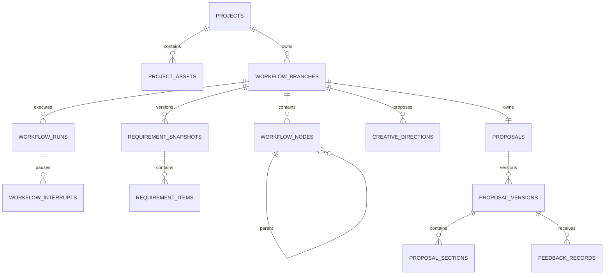
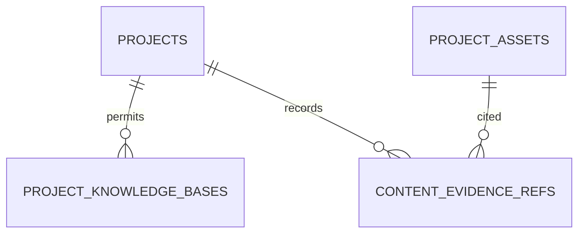

# Hai-agent ERD 数据库设计

## 1. 设计目标

本文定义 Hai-agent 第一版 PostgreSQL 表结构，覆盖：

- 活动策划项目与附件
- LangGraph 分阶段工作流
- 可回溯、可分支的树状节点
- 需求清单与确认基线
- 策划方向
- 方案、章节和不可变版本
- 用户反馈与证据引用
- AI-backend 知识库绑定与证据引用
- PostgreSQL Hybrid Search
- 入库任务抢占与失败重试

本设计先确定数据边界和关系，确认后再生成可直接执行的建表 SQL。

## 2. 数据库与 Schema

复用现有 PostgreSQL 数据库 `career_ai`，通过独立 Schema 隔离 Hai-agent 业务表：

| Schema | 用途 |
|---|---|
| `hai_agent` | Hai-agent 用户、项目、工作流、策划方向、方案和反馈 |
| `agent` | AI-backend Agent 与 LangGraph Checkpointer，由 AI-backend 管理 |

Hai-agent 只保存 `agent_thread_id` 和 `checkpoint_id` 引用，不在 `hai_agent` Schema 创建 Checkpointer 表。

## 3. 设计原则

1. 主键统一使用 UUID，默认由 `gen_random_uuid()` 生成。
2. 时间统一使用 `TIMESTAMPTZ`。
3. 不使用 PostgreSQL ENUM，状态使用 `VARCHAR` 并由应用层枚举管理，方便后续调整。
4. 已完成的工作流节点和方案版本不可原地覆盖。
5. 回溯历史节点时创建新分支，不修改原分支。
6. LangGraph Checkpoint 负责运行恢复，业务快照负责历史展示和分支恢复。
7. 方案正文、附件正文和大型检索结果不能全部塞进节点 JSONB。
8. 所有跨 AI-backend 的 ID 使用字符串保存，不建立跨数据库外键。
9. 高频过滤字段使用普通列；结构不稳定的扩展信息才使用 JSONB。
10. 所有 Agent 写操作携带 `project_id + branch_id + node_id + run_id`，并使用幂等键防止重复保存。
11. 用户归属只在项目表保存 `user_id`；访问子表前必须通过 `user_id + project_id` 校验项目归属。
12. 节点只保存 `parent_node_id`，不保存 `next_node_id`；子节点通过父节点 ID 反向查询。
13. `sequence_no` 只负责同一分支内展示顺序，不作为节点关系依据。

## 4. 表结构总览

### 4.1 hai 业务域

| 表 | 用途 |
|---|---|
| `users` | Hai-agent 本地登录用户 |
| `auth_refresh_tokens` | 可撤销、可轮换的 JWT 刷新令牌 |
| `projects` | 活动策划项目主表 |
| `project_assets` | 项目附件及解析状态 |
| `project_knowledge_bases` | 项目允许使用的企业知识库 |
| `workflow_branches` | 树状流程分支 |
| `workflow_nodes` | 不可变业务历史节点 |
| `workflow_runs` | 一次 Agent/Graph 执行记录 |
| `workflow_interrupts` | 人机确认中断及恢复记录 |
| `requirement_snapshots` | 一版项目需求清单 |
| `requirement_items` | 需求清单中的具体字段 |
| `creative_directions` | 候选与选中的策划方向 |
| `proposals` | 分支下的方案逻辑实体 |
| `proposal_versions` | 不可变方案版本 |
| `proposal_sections` | 方案版本的章节内容 |
| `feedback_records` | 用户针对方案的反馈 |
| `content_evidence_refs` | 需求、方向、方案对知识切片的引用 |

### 4.2 AI-backend 外部能力引用

Hai-agent 不创建知识库、知识文档、知识切片和入库任务表。知识库由 AI-backend 统一管理并使用 Milvus 检索。

Hai-agent 仅保留：

| 表 | 用途 |
|---|---|
| `project_knowledge_bases` | 项目可访问的 AI-backend 知识库白名单 |
| `content_evidence_refs` | 业务结果引用的外部知识切片快照 |

因此完整设计共 17 张业务表，其中认证与核心工作流首批落地 5 张表。

## 4.3 认证域

### hai_agent.users

保存本地登录用户。密码只保存 Argon2 哈希，`user_id` 同时作为项目数据隔离标识。第一版不包含角色和权限。

| 字段 | 类型 | 约束 | 说明 |
|---|---|---|---|
| `user_id` | UUID | PK | 用户 ID |
| `username` | VARCHAR(50) | NOT NULL | 登录用户名，不区分大小写唯一 |
| `email` | VARCHAR(255) | NULL | 邮箱，不区分大小写唯一 |
| `password_hash` | TEXT | NOT NULL | Argon2 密码哈希 |
| `status` | VARCHAR(30) | NOT NULL | active/disabled |
| `created_at` | TIMESTAMPTZ | NOT NULL | 创建时间 |
| `updated_at` | TIMESTAMPTZ | NOT NULL | 更新时间 |
| `last_login_at` | TIMESTAMPTZ | NULL | 最后登录时间 |

### hai_agent.auth_refresh_tokens

保存 Refresh Token 摘要与撤销状态。Access Token 不落库。

| 字段 | 类型 | 约束 | 说明 |
|---|---|---|---|
| `token_id` | UUID | PK | JWT jti |
| `user_id` | UUID | FK users | 所属用户 |
| `token_hash` | CHAR(64) | NOT NULL | Refresh Token 的 SHA-256 摘要 |
| `expires_at` | TIMESTAMPTZ | NOT NULL | 过期时间 |
| `revoked_at` | TIMESTAMPTZ | NULL | 撤销时间 |
| `created_at` | TIMESTAMPTZ | NOT NULL | 签发时间 |

## 5. 项目域

### 5.1 hai_agent.projects

活动策划项目的聚合根。

| 字段 | 类型 | 约束 | 说明 |
|---|---|---|---|
| `project_id` | UUID | PK | 项目 ID |
| `name` | VARCHAR(255) | NOT NULL | 项目名称 |
| `customer_name` | VARCHAR(255) | NULL | 客户名称 |
| `brand_name` | VARCHAR(255) | NULL | 品牌名称 |
| `event_type` | VARCHAR(100) | NULL | 发布会、年会、展览等 |
| `description` | TEXT | NULL | 项目说明 |
| `status` | VARCHAR(30) | NOT NULL | active/completed/cancelled/archived |
| `current_stage` | VARCHAR(50) | NOT NULL | 当前业务阶段 |
| `current_branch_id` | UUID | NULL | 当前激活分支 |
| `current_node_id` | UUID | NULL | 用户当前正在操作的节点 |
| `user_id` | UUID | FK users | 项目所属用户，用于用户项目隔离 |
| `metadata` | JSONB | NOT NULL DEFAULT '{}' | 扩展配置 |
| `created_at` | TIMESTAMPTZ | NOT NULL | 创建时间 |
| `updated_at` | TIMESTAMPTZ | NOT NULL | 更新时间 |
| `archived_at` | TIMESTAMPTZ | NULL | 归档时间 |

索引：

- `idx_projects_status_updated_at(status, updated_at DESC)`
- `idx_projects_user_updated_at(user_id, updated_at DESC)`
- 项目名称使用 `pg_trgm` 时可增加 GIN 模糊搜索索引。

说明：`current_branch_id` 和 `current_node_id` 分别在分支表、节点表创建后补充外键，解决初始化时的循环依赖。项目及其子数据的访问必须先使用 `user_id + project_id` 校验归属。

### 5.2 hai_agent.project_assets

保存项目与 AI-backend 文件服务之间的关系，不复制附件正文。

| 字段 | 类型 | 约束 | 说明 |
|---|---|---|---|
| `asset_id` | UUID | PK | 业务附件 ID |
| `project_id` | UUID | FK projects | 所属项目 |
| `file_id` | VARCHAR(100) | NOT NULL | AI-backend 文件 ID |
| `file_name` | VARCHAR(500) | NOT NULL | 上传时文件名快照 |
| `extension` | VARCHAR(30) | NULL | 文件扩展名 |
| `mime_type` | VARCHAR(150) | NULL | MIME 类型 |
| `size_bytes` | BIGINT | NULL | 文件大小 |
| `asset_type` | VARCHAR(50) | NOT NULL | brief/brand/meeting/case/other |
| `parse_status` | VARCHAR(30) | NOT NULL | pending/parsing/success/failed |
| `parse_error` | TEXT | NULL | 解析错误 |
| `file_metadata` | JSONB | NOT NULL DEFAULT '{}' | Outline、页数等摘要 |
| `created_by` | VARCHAR(100) | NULL | 上传用户 |
| `created_at` | TIMESTAMPTZ | NOT NULL | 创建时间 |
| `updated_at` | TIMESTAMPTZ | NOT NULL | 更新时间 |
| `deleted_at` | TIMESTAMPTZ | NULL | 软删除时间 |

约束：

- `UNIQUE(project_id, file_id)`
- 文件服务是正文权威来源，Hai-agent 保存必要快照，避免文件改名导致历史页面不可读。

### 5.3 hai_agent.project_knowledge_bases

保存项目可访问的 AI-backend 知识库白名单。这里只保存外部资源引用，不复制知识库配置，也不建立跨服务外键。

| 字段 | 类型 | 约束 | 说明 |
|---|---|---|---|
| `project_id` | UUID | PK/FK projects | 项目 ID |
| `knowledge_id` | VARCHAR(100) | PK | AI-backend 知识库 ID |
| `knowledge_name` | VARCHAR(255) | NULL | 绑定时的名称快照 |
| `enabled` | BOOLEAN | NOT NULL DEFAULT TRUE | 是否允许本项目使用 |
| `retrieval_config` | JSONB | NOT NULL DEFAULT '{}' | 项目级检索参数覆盖 |
| `created_at` | TIMESTAMPTZ | NOT NULL | 绑定时间 |
| `updated_at` | TIMESTAMPTZ | NOT NULL | 更新时间 |

运行 Agent 时，Hai-agent 查询启用的 knowledge_id 列表，并传入 AI-backend 的 `knowledge.knowledge_base_ids`。知识库是否存在、是否启用由 AI-backend 接口最终校验。

## 6. 树状工作流域

### 6.1 hai_agent.workflow_branches

每条分支代表一条独立的方案演进路线。

| 字段 | 类型 | 约束 | 说明 |
|---|---|---|---|
| `branch_id` | UUID | PK | 分支 ID |
| `project_id` | UUID | FK projects | 所属项目 |
| `name` | VARCHAR(255) | NOT NULL | 分支名称 |
| `source_branch_id` | UUID | FK self NULL | 来源分支 |
| `source_node_id` | UUID | NULL | 从哪个历史节点分出 |
| `head_node_id` | UUID | NULL | 当前分支头节点 |
| `status` | VARCHAR(30) | NOT NULL | active/completed/archived |
| `is_main` | BOOLEAN | NOT NULL DEFAULT FALSE | 是否主分支 |
| `created_by` | VARCHAR(100) | NULL | 创建人 |
| `created_at` | TIMESTAMPTZ | NOT NULL | 创建时间 |
| `updated_at` | TIMESTAMPTZ | NOT NULL | 更新时间 |
| `archived_at` | TIMESTAMPTZ | NULL | 归档时间 |

约束与索引：

- 同一项目只能有一个 `is_main=true` 的部分唯一索引。
- `idx_workflow_branches_project(project_id, created_at)`
- `source_node_id` 和 `head_node_id` 在节点表创建后补外键。

### 6.2 hai_agent.workflow_nodes

保存树状流程中的不可变业务节点。

| 字段 | 类型 | 约束 | 说明 |
|---|---|---|---|
| `node_id` | UUID | PK | 节点 ID |
| `project_id` | UUID | FK projects | 所属项目 |
| `branch_id` | UUID | FK branches | 所属分支 |
| `parent_node_id` | UUID | FK self NULL | 父节点 |
| `sequence_no` | INTEGER | NOT NULL | 分支内序号 |
| `node_type` | VARCHAR(60) | NOT NULL | 节点业务类型 |
| `stage` | VARCHAR(50) | NOT NULL | 节点所属阶段 |
| `status` | VARCHAR(30) | NOT NULL | working/ready/completed/failed/cancelled |
| `title` | VARCHAR(255) | NOT NULL | 节点标题 |
| `summary` | TEXT | NULL | 节点结果摘要 |
| `input_context` | JSONB | NOT NULL DEFAULT '{}' | 节点启动时接收的交接上下文 |
| `result_data` | JSONB | NOT NULL DEFAULT '{}' | Agent 保存的当前阶段最新结果 |
| `handoff_context` | JSONB | NOT NULL DEFAULT '{}' | 节点完成后交给后续节点的累计业务状态 |
| `result_version` | INTEGER | NOT NULL DEFAULT 0 | 结果版本号，用于并发控制 |
| `run_id` | UUID | NULL | 产生该节点的运行 |
| `agent_thread_id` | VARCHAR(150) | NULL | 当前节点独立的 LangGraph thread_id |
| `checkpoint_id` | VARCHAR(255) | NULL | 对应 LangGraph Checkpoint |
| `error_code` | VARCHAR(100) | NULL | 错误编码 |
| `error_message` | TEXT | NULL | 错误信息 |
| `started_at` | TIMESTAMPTZ | NULL | 开始时间 |
| `completed_at` | TIMESTAMPTZ | NULL | 完成时间 |
| `result_updated_at` | TIMESTAMPTZ | NULL | 阶段结果最后更新时间 |
| `created_at` | TIMESTAMPTZ | NOT NULL | 创建时间 |

约束：

- `UNIQUE(branch_id, sequence_no)`
- 节点只保存可为空的 `parent_node_id`，不得增加 `next_node_id`。
- 子节点统一通过 `WHERE parent_node_id = :node_id` 查询。
- `sequence_no` 仅用于分支内展示排序，节点树关系以 `parent_node_id` 为准。
- 已完成节点不允许更新 `result_data` 和 `handoff_context`，只允许补充必要的追踪字段。
- `handoff_context` 只保存下游需要的累计事实、业务对象 ID 和摘要，不存完整消息历史与大篇方案正文。
- 一个步骤节点对应一个独立 `agent_thread_id`，节点之间不得复用或复制 Checkpoint。

索引：

- `idx_workflow_nodes_project_branch(project_id, branch_id, sequence_no)`
- `idx_workflow_nodes_parent(parent_node_id)`
- `idx_workflow_nodes_status(status, created_at)`

### 6.3 hai_agent.workflow_runs

记录一次工作流或 Agent 执行，供重试、监控和 LangSmith 关联。

| 字段 | 类型 | 约束 | 说明 |
|---|---|---|---|
| `run_id` | UUID | PK | 运行 ID |
| `project_id` | UUID | FK projects | 项目 |
| `branch_id` | UUID | FK branches | 分支 |
| `node_id` | UUID | FK nodes NULL | 当前业务节点 |
| `parent_run_id` | UUID | FK self NULL | 父运行，如专业子 Agent |
| `run_type` | VARCHAR(30) | NOT NULL | main/sub_agent/system |
| `agent_id` | VARCHAR(100) | NULL | AI-backend Agent 模板 ID |
| `agent_conversation_id` | VARCHAR(150) | NULL | AI-backend 展示会话 ID |
| `agent_thread_id` | VARCHAR(150) | NULL | 本次节点执行使用的 LangGraph thread_id |
| `status` | VARCHAR(30) | NOT NULL | pending/running/interrupted/completed/failed/cancelled |
| `idempotency_key` | VARCHAR(255) | NOT NULL | 幂等键 |
| `request_summary` | JSONB | NOT NULL DEFAULT '{}' | 脱敏后的请求摘要 |
| `result_summary` | JSONB | NOT NULL DEFAULT '{}' | 结果摘要 |
| `error_code` | VARCHAR(100) | NULL | 错误编码 |
| `error_message` | TEXT | NULL | 错误信息 |
| `trace_id` | VARCHAR(150) | NULL | LangSmith Trace ID |
| `started_at` | TIMESTAMPTZ | NULL | 开始时间 |
| `finished_at` | TIMESTAMPTZ | NULL | 结束时间 |
| `created_at` | TIMESTAMPTZ | NOT NULL | 创建时间 |

约束：

- `UNIQUE(idempotency_key)`
- `idx_workflow_runs_branch_status(branch_id, status, created_at DESC)`

### 6.4 hai_agent.workflow_interrupts

保存需求确认、策划方向选择、大纲确认等结构化中断。

| 字段 | 类型 | 约束 | 说明 |
|---|---|---|---|
| `interrupt_id` | UUID | PK | 中断 ID |
| `run_id` | UUID | FK runs | 所属运行 |
| `project_id` | UUID | FK projects | 项目 |
| `branch_id` | UUID | FK branches | 分支 |
| `node_id` | UUID | FK nodes | 触发节点 |
| `interrupt_type` | VARCHAR(80) | NOT NULL | 中断类型 |
| `payload` | JSONB | NOT NULL | 前端卡片数据 |
| `status` | VARCHAR(30) | NOT NULL | pending/resolved/cancelled/expired |
| `response_value` | JSONB | NULL | 用户结构化回复 |
| `response_message` | TEXT | NULL | 用户补充文字 |
| `resolved_by` | VARCHAR(100) | NULL | 操作用户 |
| `created_at` | TIMESTAMPTZ | NOT NULL | 触发时间 |
| `resolved_at` | TIMESTAMPTZ | NULL | 恢复时间 |

约束：

- 同一运行只允许一个 `status='pending'` 的部分唯一索引。
- 恢复请求必须带 `interrupt_id`，重复提交返回已有结果，不能再次执行工作流。


## 7. 需求与策划方向域

### 7.1 hai_agent.requirement_snapshots

一条记录代表一个分支在某个时刻的完整需求清单版本。

| 字段 | 类型 | 约束 | 说明 |
|---|---|---|---|
| `snapshot_id` | UUID | PK | 需求快照 ID |
| `project_id` | UUID | FK projects | 项目 |
| `branch_id` | UUID | FK branches | 分支 |
| `source_node_id` | UUID | FK nodes | 产生快照的节点 |
| `parent_snapshot_id` | UUID | FK self NULL | 上一版需求快照 |
| `version_no` | INTEGER | NOT NULL | 分支内版本号 |
| `status` | VARCHAR(30) | NOT NULL | draft/confirmed/superseded |
| `completeness_score` | NUMERIC(5,2) | NOT NULL DEFAULT 0 | 需求完整度 |
| `summary` | TEXT | NULL | Agent 生成的需求摘要 |
| `confirmed_by` | VARCHAR(100) | NULL | 确认用户 |
| `confirmed_at` | TIMESTAMPTZ | NULL | 确认时间 |
| `created_at` | TIMESTAMPTZ | NOT NULL | 创建时间 |

约束：

- `UNIQUE(branch_id, version_no)`
- 同一分支最多一个 `status='confirmed'` 的当前需求基线；产生新基线时旧基线改为 superseded。
- 已 confirmed 的快照及其 items 不允许修改。

### 7.2 hai_agent.requirement_items

需求清单中的最小可确认信息。

| 字段 | 类型 | 约束 | 说明 |
|---|---|---|---|
| `item_id` | UUID | PK | 条目 ID |
| `snapshot_id` | UUID | FK snapshots | 所属快照 |
| `category` | VARCHAR(80) | NOT NULL | basic/goal/audience/budget/style/constraint/deliverable |
| `field_code` | VARCHAR(100) | NOT NULL | 稳定字段编码 |
| `field_name` | VARCHAR(255) | NOT NULL | 展示名称 |
| `value` | JSONB | NULL | 字符串、数值、列表或对象 |
| `item_status` | VARCHAR(30) | NOT NULL | confirmed/pending/conflict/assumed |
| `confidence` | NUMERIC(5,4) | NULL | Agent 提取置信度 |
| `conflict_values` | JSONB | NOT NULL DEFAULT '[]' | 冲突候选值 |
| `sort_order` | INTEGER | NOT NULL DEFAULT 0 | 展示顺序 |
| `created_at` | TIMESTAMPTZ | NOT NULL | 创建时间 |

约束：

- `UNIQUE(snapshot_id, field_code)`
- 来源证据统一放在 `content_evidence_refs`，不在此表重复维护任意格式的 source JSON。

### 7.3 hai_agent.creative_directions

保存 Agent 生成的策划方向候选及用户选择结果。

| 字段 | 类型 | 约束 | 说明 |
|---|---|---|---|
| `direction_id` | UUID | PK | 策划方向 ID |
| `project_id` | UUID | FK projects | 项目 |
| `branch_id` | UUID | FK branches | 分支 |
| `source_node_id` | UUID | FK nodes | 生成节点 |
| `requirement_snapshot_id` | UUID | FK snapshots | 使用的需求基线 |
| `title` | VARCHAR(255) | NOT NULL | 方向名称 |
| `theme` | VARCHAR(500) | NULL | 核心主题 |
| `concept` | TEXT | NOT NULL | 创意概念 |
| `strategy` | JSONB | NOT NULL DEFAULT '{}' | 受众体验、环节、传播等 |
| `risks` | JSONB | NOT NULL DEFAULT '[]' | 风险与限制 |
| `status` | VARCHAR(30) | NOT NULL | candidate/selected/rejected |
| `sort_order` | INTEGER | NOT NULL DEFAULT 0 | 候选排序 |
| `selected_at` | TIMESTAMPTZ | NULL | 选中时间 |
| `created_at` | TIMESTAMPTZ | NOT NULL | 创建时间 |

约束：

- 一个分支同一时刻只允许一个 selected 方向。
- 用户组合多个候选方向时，创建一条新的 selected 方向，而不是同时选中多条候选记录。

## 8. 方案与反馈域

### 8.1 hai_agent.proposals

分支下的方案逻辑实体。方案内容实际保存在版本和章节表。

| 字段 | 类型 | 约束 | 说明 |
|---|---|---|---|
| `proposal_id` | UUID | PK | 方案 ID |
| `project_id` | UUID | FK projects | 项目 |
| `branch_id` | UUID | FK branches | 分支 |
| `title` | VARCHAR(255) | NOT NULL | 方案标题 |
| `status` | VARCHAR(30) | NOT NULL | drafting/reviewing/completed/archived |
| `current_version_id` | UUID | NULL | 当前采用版本 |
| `created_at` | TIMESTAMPTZ | NOT NULL | 创建时间 |
| `updated_at` | TIMESTAMPTZ | NOT NULL | 更新时间 |

约束：

- 默认 `UNIQUE(branch_id)`，第一版每个分支维护一份主方案。
- `current_version_id` 在版本表创建后补外键。

### 8.2 hai_agent.proposal_versions

不可变的完整方案版本。

| 字段 | 类型 | 约束 | 说明 |
|---|---|---|---|
| `version_id` | UUID | PK | 版本 ID |
| `proposal_id` | UUID | FK proposals | 所属方案 |
| `branch_id` | UUID | FK branches | 所属分支 |
| `parent_version_id` | UUID | FK self NULL | 修改前版本 |
| `source_node_id` | UUID | FK nodes | 产生版本的节点 |
| `requirement_snapshot_id` | UUID | FK snapshots | 使用的需求基线 |
| `direction_id` | UUID | FK directions | 使用的策划方向 |
| `version_no` | INTEGER | NOT NULL | 分支方案版本号 |
| `status` | VARCHAR(30) | NOT NULL | drafting/completed/failed |
| `outline` | JSONB | NOT NULL DEFAULT '[]' | 方案目录与章节标识 |
| `content_markdown` | TEXT | NULL | 完成后的整合 Markdown |
| `change_summary` | TEXT | NULL | 相对父版本的修改摘要 |
| `review_result` | JSONB | NOT NULL DEFAULT '{}' | 一致性审查结果 |
| `created_by_type` | VARCHAR(30) | NOT NULL | agent/user/system |
| `created_at` | TIMESTAMPTZ | NOT NULL | 创建时间 |
| `completed_at` | TIMESTAMPTZ | NULL | 完成时间 |

约束：

- `UNIQUE(proposal_id, version_no)`
- completed 版本不可修改。
- `content_markdown` 是所有章节稳定整合后的快照，便于导出和历史查看。

### 8.3 hai_agent.proposal_sections

支持按章节逐步生成和失败续写。

| 字段 | 类型 | 约束 | 说明 |
|---|---|---|---|
| `section_id` | UUID | PK | 章节 ID |
| `version_id` | UUID | FK versions | 所属版本 |
| `section_key` | VARCHAR(100) | NOT NULL | 稳定章节编码 |
| `parent_section_id` | UUID | FK self NULL | 父章节 |
| `title` | VARCHAR(500) | NOT NULL | 章节标题 |
| `sort_order` | INTEGER | NOT NULL | 展示顺序 |
| `status` | VARCHAR(30) | NOT NULL | pending/generating/completed/failed |
| `content_markdown` | TEXT | NULL | 章节正文 |
| `content_hash` | VARCHAR(64) | NULL | 内容哈希 |
| `generation_run_id` | UUID | FK runs NULL | 生成运行 |
| `error_message` | TEXT | NULL | 失败原因 |
| `created_at` | TIMESTAMPTZ | NOT NULL | 创建时间 |
| `updated_at` | TIMESTAMPTZ | NOT NULL | 更新时间 |

约束：

- `UNIQUE(version_id, section_key)`
- 工具使用 `version_id + section_key` 幂等写入，避免模型重试产生重复章节。

### 8.4 hai_agent.feedback_records

记录用户对整份方案、章节或文本区域的反馈。

| 字段 | 类型 | 约束 | 说明 |
|---|---|---|---|
| `feedback_id` | UUID | PK | 反馈 ID |
| `project_id` | UUID | FK projects | 项目 |
| `branch_id` | UUID | FK branches | 分支 |
| `version_id` | UUID | FK versions | 针对的方案版本 |
| `target_type` | VARCHAR(30) | NOT NULL | proposal/section/selection |
| `target_id` | UUID | NULL | 章节等目标 ID |
| `selection_range` | JSONB | NULL | 文本选择范围与原文快照 |
| `content` | TEXT | NOT NULL | 用户反馈 |
| `impact_level` | VARCHAR(30) | NOT NULL | minor/section/major |
| `status` | VARCHAR(30) | NOT NULL | pending/processing/resolved/rejected |
| `created_by` | VARCHAR(100) | NULL | 用户 |
| `created_at` | TIMESTAMPTZ | NOT NULL | 创建时间 |
| `resolved_at` | TIMESTAMPTZ | NULL | 完成时间 |

重大反馈触发新分支或新需求基线；小范围反馈在当前分支创建新方案版本。

### 8.5 hai_agent.content_evidence_refs

统一记录需求、策划方向和方案内容实际采用的项目附件或 AI-backend 知识库证据。

| 字段 | 类型 | 约束 | 说明 |
|---|---|---|---|
| `evidence_ref_id` | UUID | PK | 引用 ID |
| `project_id` | UUID | FK projects | 项目 |
| `branch_id` | UUID | FK branches | 分支 |
| `target_type` | VARCHAR(50) | NOT NULL | requirement_item/direction/section |
| `target_id` | UUID | NOT NULL | 被引用业务对象 ID |
| `source_type` | VARCHAR(30) | NOT NULL | project_asset/ai_knowledge_chunk |
| `asset_id` | UUID | FK assets NULL | 项目附件 |
| `knowledge_id` | VARCHAR(100) | NULL | AI-backend 知识库 ID |
| `file_id` | VARCHAR(100) | NULL | AI-backend 文件 ID |
| `chunk_id` | VARCHAR(150) | NULL | Milvus/检索结果切片 ID |
| `source_name` | VARCHAR(500) | NULL | 来源名称快照 |
| `quote_text` | TEXT | NULL | 实际采用的证据文本快照 |
| `relevance_score` | DOUBLE PRECISION | NULL | 检索或判断分数 |
| `created_at` | TIMESTAMPTZ | NOT NULL | 创建时间 |

约束：

- `source_type=project_asset` 时 asset_id 必填。
- `source_type=ai_knowledge_chunk` 时 knowledge_id、file_id、chunk_id 必填。
- 外部知识字段不建立外键，避免跨服务数据库耦合。
- 即使 AI-backend 后续删除文档，历史方案仍可通过 source_name 和 quote_text 解释当时使用了什么证据。
- 应用层校验 `target_type + target_id` 指向真实业务对象。

## 9. AI-backend 知识库复用边界

Hai-agent 不创建 `hai_kb` Schema，也不直接连接 Milvus。现有 AI-backend 继续负责：

- 知识库增删改查
- 文档上传、解析、切片和入库任务
- Embedding 与 Rerank 模型调用
- PostgreSQL 知识元数据
- Milvus 向量存储
- 关键词、向量和混合检索
- Agent 内置 `search_knowledge_base` 工具

Hai-agent 只负责项目知识库白名单和业务证据引用。

调用链路：

```text
project_knowledge_bases
    -> Hai-agent 调用 AI-backend /agent/messages
    -> optional_features.knowledge_enabled = true
    -> knowledge.knowledge_base_ids = [...]
    -> AI-backend Runtime Context
    -> 自动挂载 search_knowledge_base
    -> AI-backend KnowledgeService + Milvus
    -> 检索结果注入 Agent State
    -> Agent 生成业务结果
    -> Hai-agent 保存 content_evidence_refs
```

这种方式可以直接复用当前 AI 平台的知识库管理界面、入库 Worker、检索测试和 Milvus 能力，Hai-agent 不承担重复维护成本。

## 10. 核心关系

### 10.1 项目与工作流



### 10.2 外部知识库与证据



AI-backend knowledge_id、file_id 和 chunk_id 是外部标识，不出现在本地 ERD 外键关系中。

## 11. 状态字典

### 11.1 项目阶段

- `preparation`
- `requirement_confirm`
- `creative_direction`
- `proposal_generation`
- `feedback_revision`
- `completed`
- `cancelled`

### 11.2 工作流节点状态

- `pending`
- `running`
- `waiting_human`
- `completed`
- `failed`
- `cancelled`

### 11.3 需求条目状态

- `confirmed`
- `pending`
- `conflict`
- `assumed`

这些状态先由 Python Enum 与 Pydantic Schema 管理。等业务稳定后，再考虑增加数据库 CHECK 约束，避免第一版频繁迁移。

## 12. 数据写入链路

### 12.1 创建项目

1. 插入 `projects`。
2. 插入主分支 `workflow_branches`。
3. 插入根节点 `workflow_nodes`。
4. 回写 branch.head_node_id、project.current_branch_id 与 project.current_node_id。
5. 全部操作在同一事务中完成。

### 12.2 Agent 更新需求

1. 创建 working 节点、独立 agent_thread_id 和 workflow_run。
2. Agent 通过 `save_stage_result` 提交当前阶段 JSON 结果。
3. 根据阶段需要创建 requirement_snapshot、requirement_items 和 content_evidence_refs。
4. 更新节点的 result_data、summary 和 result_version。
5. 校验通过后将节点标记为 ready，等待用户点击进入下一步。
6. 用户确认后冻结节点结果、构建 handoff_context，并将节点标记为 completed。
7. 创建具有新 agent_thread_id 的下一步骤节点，并将分支 head 指向新节点。

### 12.3 生成方案章节

1. 创建 proposal_version，状态 drafting。
2. 根据大纲预建 proposal_sections。
3. Agent 每完成一章，按 `version_id + section_key` 幂等更新。
4. 所有章节完成后整合 content_markdown。
5. 审查通过后版本标记 completed。
6. 更新 proposal.current_version_id。
7. 创建 proposal_version_created 工作流节点。

### 12.4 从历史节点创建分支

1. 锁定项目，读取已完成历史节点的 handoff_context。
2. 创建新的 workflow_branch，并记录 source_branch_id 和 source_node_id。
3. 创建新分支首个步骤节点，parent_node_id 指向来源节点。
4. 为新节点创建独立 agent_thread_id 和全新的 Checkpoint。
5. 将来源节点 handoff_context 写入新节点 input_context，不复制旧 Checkpoint 和完整消息历史。
6. 后续发生修改时创建新的快照或版本。
7. 原分支不做任何修改。

## 13. 删除与归档策略

1. 项目、分支和附件采用软删除或归档。
2. 已完成工作流节点、方案版本、反馈和证据引用不提供物理删除接口。
3. 未完成的草稿版本可由后台清理任务定期删除。
5. 原始文件是否物理删除由统一文件服务的保留策略控制。
6. 项目归档后不允许继续运行 Agent，但仍可查看历史和导出方案。

## 14. 第一版明确不建的表

为避免过度设计，第一版不创建：

- 角色、菜单和细粒度权限表：第一版只有登录鉴权与项目归属隔离。
- Agent 模板和模型表：由 AI-backend 负责。
- 重复的会话消息表：由 AI-backend ConversationService 负责。
- 独立工作流边表：当前是树结构，`parent_node_id` 足够。
- 单独阶段历史表：不可变 workflow_nodes 已经提供阶段历史。
- 本地知识库与 Retrieval Run 表：统一复用 AI-backend，通过 content_evidence_refs 记录业务采用的证据。

## 15. 建表顺序

1. 扩展：`pgcrypto`，可选 `pg_trgm`
2. Schema：`hai_agent`（AI-backend 已有的 `agent`、`knowledge` Schema 不由本项目创建）
3. `hai_agent.users`、`hai_agent.auth_refresh_tokens`
4. `hai_agent.projects`
5. `hai_agent.workflow_branches`
6. `hai_agent.workflow_nodes`
7. 回补 projects、branches 的循环外键
8. `workflow_runs`、`workflow_interrupts`，并回补 `workflow_nodes.run_id` 外键
9. `project_assets`、`project_knowledge_bases`
10. `requirement_snapshots`、`requirement_items`
11. `creative_directions`
12. `proposals`、`proposal_versions`、`proposal_sections`
13. 回补 `proposals.current_version_id` 外键
14. `feedback_records`、`content_evidence_refs`
15. 索引、注释和更新时间触发器
16. LangGraph Checkpointer 初始化

不安装 pgvector，不创建知识切片或入库任务表；这些由 AI-backend 所在数据库和 Milvus 负责。

## 16. 已确定的实现参数

1. Hai-agent 复用 `career_ai` 数据库，并使用独立 `hai_agent` Schema 隔离业务表。
2. 业务表位于 `hai_agent` Schema；工作流 Checkpoint 由 AI-backend Agent 服务管理。
3. Hai-agent 本地维护用户登录；JWT `sub` 保存 `user_id`，项目和工作流接口从令牌解析用户，不接收请求体中的 `user_id`。
4. 第一版不建设角色和细粒度权限，只实现身份认证与项目归属隔离。
5. 第一版每个分支维护一份主方案。
6. 附件解析、Agent、模型和知识库全部复用 AI-backend。
7. 项目通过 `project_knowledge_bases` 保存 AI-backend 知识库白名单。
8. 历史证据只保存外部 ID 和引用文本快照，不建立跨服务外键。

