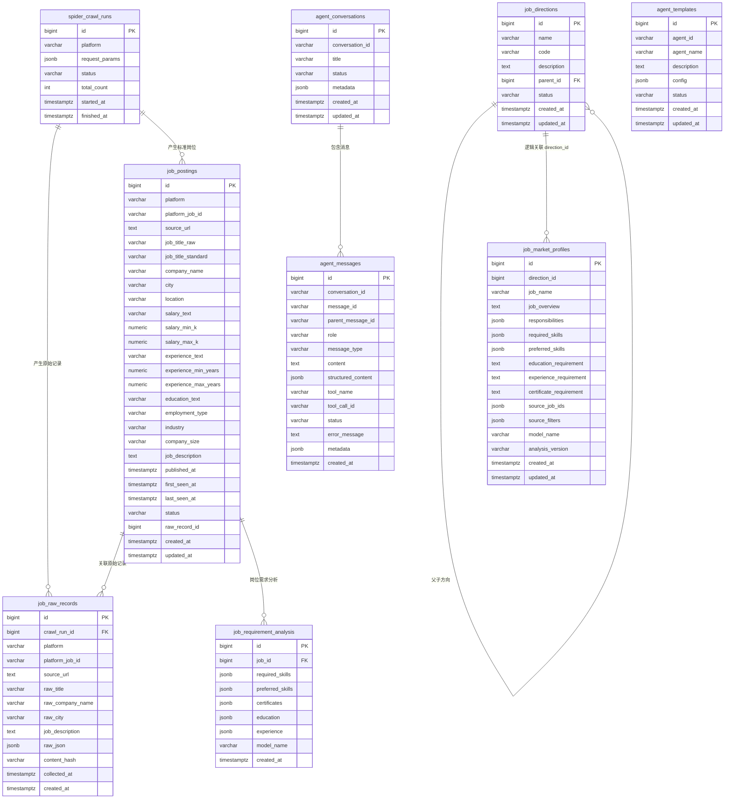

# ERD - 数据库设计

## 1. 数据库分区

当前数据库使用 PostgreSQL。

建议 schema 划分：

| Schema | 用途 |
| --- | --- |
| `public` | 当前岗位、爬虫相关表所在位置 |
| `agent` | Agent 会话、消息、模板、Checkpoint 相关表 |

后续如果岗位和爬虫表增多，可以继续拆成 `job` schema 和 `spider` schema。

## 2. 总体 ERD



## 3. 核心表说明

### 3.1 `spider_crawl_runs`

记录每一次爬虫运行。

典型用途：

- 追踪某次采集请求参数。
- 统计采集数量。
- 排查采集失败原因。
- 关联本次采集产生的原始记录。

### 3.2 `job_raw_records`

保存招聘平台返回的原始数据。

设计原因：

- 招聘正文 `job_description` 是岗位画像生成最重要的数据来源。
- 原始 JSON 后续可以重新解析，不需要重复爬取。
- 不同招聘平台字段不稳定，JSONB 更适合保留原始结构。

### 3.3 `job_postings`

保存标准化后的岗位信息。

设计原因：

- 平台查询、筛选、分页主要依赖这张表。
- 标准字段便于后续聚合分析。
- 与原始记录分离，避免业务查询直接依赖平台原始字段。

### 3.4 `job_directions`

保存平台定义的岗位方向，例如 AI 应用开发、测试工程师、Java 后端开发。

设计原因：

- 岗位方向是平台自己的业务概念，不等同于招聘网站岗位标题。
- 一个岗位方向可以聚合多个招聘岗位样本。
- 后续画像、课程、技能树可以围绕岗位方向展开。

### 3.5 `job_market_profiles`

保存某个岗位方向的聚合画像。

建议一个岗位方向保留一份最新画像。如果需要历史版本，可以后续新增版本表或保留多版本字段。

### 3.6 `agent.agent_conversations`

保存 Agent 会话主记录。

注意：

- 会话只通过 `conversation_id` 追踪。
- 不绑定 `agent_id`。
- 不承担权限隔离，权限由 Java 层处理。

### 3.7 `agent.agent_messages`

保存 Agent 会话消息。

消息类型可以区分：

- 用户问题
- 模型回复
- 工具调用摘要
- 工具结果摘要
- 错误消息

### 3.8 `agent.agent_templates`

保存 Agent 模板。

注意：

- `agent_id` 只用于模板稳定标识。
- `/agent/run` 不直接绑定 `agent_id`。
- 调用方可以先查询模板，再把模板配置展开为 `/agent/run` 请求。

## 4. 关系说明

| 关系 | 类型 | 说明 |
| --- | --- | --- |
| `spider_crawl_runs -> job_raw_records` | 一对多 | 一次采集产生多条原始记录。 |
| `spider_crawl_runs -> job_postings` | 一对多 | 一次采集可产生多条标准岗位。 |
| `job_postings -> job_raw_records` | 逻辑关联 | 标准岗位可以关联最新原始记录。 |
| `job_directions -> job_market_profiles` | 一对一或一对多 | 当前建议一对一保留最新画像；历史版本另行扩展。 |
| `agent_conversations -> agent_messages` | 一对多 | 一个会话包含多条历史消息。 |
| `agent_templates` | 独立表 | 模板不直接绑定会话，也不直接绑定运行请求。 |

## 5. 索引建议

```sql
CREATE INDEX IF NOT EXISTS idx_job_postings_keyword
ON job_postings(job_title_raw);

CREATE INDEX IF NOT EXISTS idx_job_postings_city
ON job_postings(city);

CREATE INDEX IF NOT EXISTS idx_job_postings_platform
ON job_postings(platform);

CREATE INDEX IF NOT EXISTS idx_job_raw_records_job_id
ON job_raw_records(platform, platform_job_id);

CREATE UNIQUE INDEX IF NOT EXISTS uq_job_directions_code
ON job_directions(code)
WHERE code IS NOT NULL;

CREATE UNIQUE INDEX IF NOT EXISTS uq_job_market_profiles_direction_id
ON job_market_profiles(direction_id);

CREATE UNIQUE INDEX IF NOT EXISTS uq_agent_conversations_conversation_id
ON agent.agent_conversations(conversation_id);

CREATE INDEX IF NOT EXISTS idx_agent_messages_conversation_created
ON agent.agent_messages(conversation_id, created_at);

CREATE UNIQUE INDEX IF NOT EXISTS uq_agent_templates_agent_id
ON agent.agent_templates(agent_id);
```

如果当前表结构还没有 `job_market_profiles.direction_id`，建议后续补充该字段，让画像和岗位方向用稳定主键关联。

