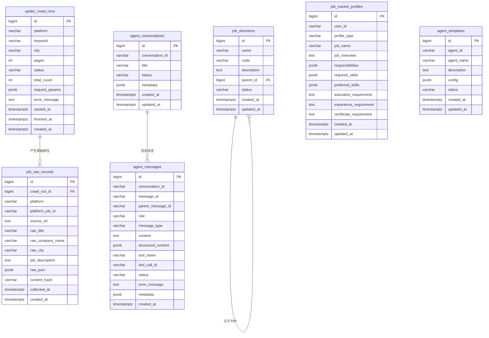

# ERD - 数据库设计

## 1. 数据库分区

当前数据库使用 PostgreSQL。

| Schema | 用途 |
| --- | --- |
| `public` | 岗位业务表、爬虫任务表。 |
| `agent` | Agent 会话、消息、模板、Checkpoint 相关表。 |

当前岗位业务已经简化：前端主展示数据来自 `job_market_profiles`，招聘网站采集结果只作为画像生成样本保存在 `job_raw_records`。

## 2. 核心 ERD



## 3. 表说明

### 3.1 `spider_crawl_runs`

记录每一次爬虫运行，用于排查采集参数、采集数量、失败原因和采集时间。

### 3.2 `job_raw_records`

保存招聘平台返回的原始岗位数据。

设计原则：

- 只抽取少量通用检索字段，例如岗位标题、公司、城市、JD 正文。
- 完整平台字段保存在 `raw_json`，方便后续重新解析。
- 它是岗位画像生成的数据来源，不作为前端主展示对象。

### 3.3 `job_directions`

保存平台定义的岗位方向字典，例如“AI应用开发”“测试工程师”“Java后端开发”。

设计原则：

- 岗位方向是平台业务概念，不等同于招聘网站岗位标题。
- 一个岗位方向可以聚合多条原始招聘样本。
- 岗位画像、课程、技能树后续都围绕岗位方向展开。

### 3.4 `job_market_profiles`

保存 Agent 根据平台岗位信息或用户上传岗位信息提炼出的岗位画像，是前端页面的主展示数据。

设计原则：

- 画像表只保存前端需要展示的业务内容。
- `profile_type` 区分系统画像和用户生成画像，取值为 `system` 或 `user`。
- 系统画像的 `user_id` 为空，用户生成画像记录所属用户 ID。
- 如后续需要生成溯源、模型记录或历史版本，应新增独立的画像生成任务表。

## 4. 当前保留与清理策略

当前保留：

- `spider_crawl_runs`
- `job_raw_records`
- `job_directions`
- `job_market_profiles`

当前不再使用：

- `job_postings`
- `job_requirement_analysis`

## 5. 索引建议

```sql
CREATE INDEX IF NOT EXISTS idx_job_raw_records_platform
ON job_raw_records(platform);

CREATE INDEX IF NOT EXISTS idx_job_raw_records_city
ON job_raw_records(raw_city);

CREATE INDEX IF NOT EXISTS idx_job_raw_records_title
ON job_raw_records(raw_title);

CREATE INDEX IF NOT EXISTS idx_job_raw_records_collected_at
ON job_raw_records(collected_at);

CREATE UNIQUE INDEX IF NOT EXISTS uq_job_directions_code
ON job_directions(code)
WHERE code IS NOT NULL;

CREATE INDEX IF NOT EXISTS idx_job_market_profiles_profile_type
ON job_market_profiles(profile_type);

CREATE INDEX IF NOT EXISTS idx_job_market_profiles_user_id
ON job_market_profiles(user_id);

CREATE INDEX IF NOT EXISTS idx_agent_messages_conversation_created
ON agent.agent_messages(conversation_id, created_at);
```

## 6. 数据库清理 SQL

确认业务代码已经不再依赖旧表后，可以执行：

```sql
DROP TABLE IF EXISTS job_requirement_analysis;
DROP TABLE IF EXISTS job_postings;
```
