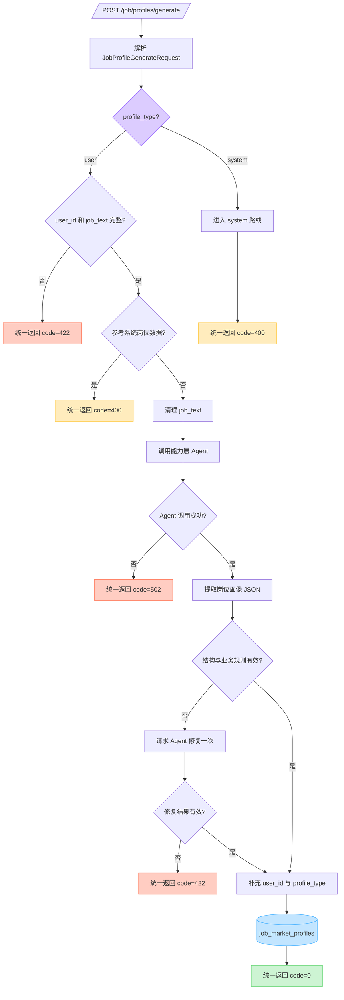

# 岗位画像生成接口流程图

## 1. 接口

```http
POST /job/profiles/generate
```

该接口通过 `profile_type` 区分用户画像和系统画像生成路线。

## 2. 完整流程



## 3. 路线说明

- `profile_type=user`：校验用户路线参数，调用 Agent 生成岗位画像并保存。
- `profile_type=system`：进入系统画像路线，当前返回功能未开放。
- Agent 首次输出校验失败时，只允许修复一次，防止无限重试。
- 只有通过结构校验和业务规则校验的画像才能写入数据库。

## 4. 统一响应格式

所有成功和失败响应统一使用以下结构：

```json
{
  "code": 0,
  "msg": "success",
  "data": {}
}
```

字段约定：

- `code=0` 表示成功，其他值表示业务失败。
- `msg` 表示成功提示或错误原因。
- `data` 是实际业务数据，可以是对象、列表、字符串或 `null`。
- 当前项目的 HTTP 状态码统一返回 `200`，调用方通过 `code` 判断业务是否成功。

失败响应示例：

```json
{
  "code": 422,
  "msg": "profile_type=user 时以下参数不能为空：user_id、job_text",
  "data": null
}
```
