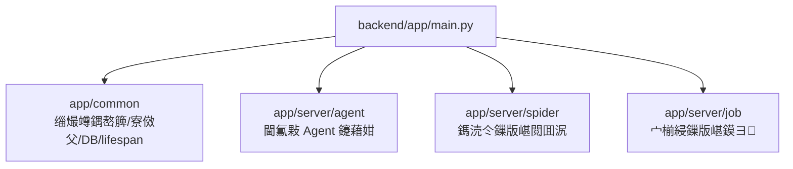
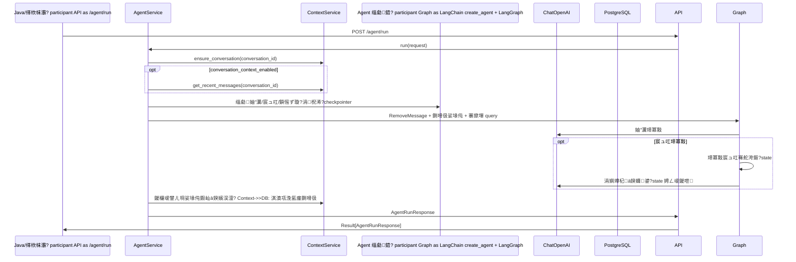

# 灏变笟鎸囧 AI 骞冲彴鏋舵瀯鍥?
## 1. 鎬讳綋杈圭晫

褰撳墠骞冲彴寤鸿鎷嗘垚涓ゅ眰 Python 鍚庣锛?
- 鑳藉姏灞傦細鎻愪緵閫氱敤 AI 鑳藉姏锛屼笉鐩存帴缁戝畾鍏蜂綋涓氬姟娴佺▼锛屼緥濡?Agent銆佹ā鍨嬭皟鐢ㄣ€佸伐鍏锋敞鍐屻€佺埇铏噰闆嗐€佹祻瑙堝櫒鑷姩鍖栥€佸悜閲忔绱㈢瓑銆?- 缂栨帓灞傦細鎵挎帴灏变笟鎸囧骞冲彴涓氬姟娴佺▼锛屼緥濡傚矖浣嶇敾鍍忕敓鎴愩€佸矖浣嶇敾鍍忓鍒犳敼鏌ャ€佺畝鍘嗗垎鏋愭祦绋嬨€佽亴涓氳鍒掓祦绋嬬瓑銆?
Java 鍚庣浣滀负骞冲彴鎺у埗灞傦紝璐熻矗鐧诲綍銆佹潈闄愩€佺敤鎴枫€佺粍缁囥€侀〉闈㈡祦杞€佷换鍔″叆鍙ｅ拰璋冪敤 Python 鏈嶅姟銆?
```mermaid
flowchart LR
    U["鍓嶇鐢ㄦ埛"] --> J["Java 骞冲彴鎺у埗灞?br/>鐧诲綍/鏉冮檺/鐢ㄦ埛/椤甸潰娴佺▼"]
    J --> O["Python 缂栨帓灞?br/>宀椾綅鐢诲儚/绠€鍘嗗垎鏋?鑱屼笟瑙勫垝"]
    O --> C["Python 鑳藉姏灞?br/>Agent/鐖櫕/妯″瀷/宸ュ叿"]

    C --> LLM["OpenAI 鍏煎妯″瀷鏈嶅姟<br/>ChatOpenAI/Embedding/Rerank"]
    C --> WEB["鎷涜仒缃戠珯<br/>鍓嶇▼鏃犲咖/鍚庣画鍏朵粬骞冲彴"]
    C --> DB[("PostgreSQL<br/>宀椾綅搴?Agent 涓婁笅鏂?妯℃澘")]
    C --> LS["LangSmith<br/>閾捐矾杩借釜锛屽彲閫?]

    O --> DB
```

## 2. 鐩爣鏈嶅姟鎷嗗垎

```mermaid
flowchart TB
    subgraph Java["Java 骞冲彴鎺у埗灞?]
        Auth["鏉冮檺璁よ瘉"]
        User["鐢ㄦ埛涓庣粍缁?]
        Page["椤甸潰涓庝换鍔″叆鍙?]
    end

    subgraph Orchestration["Python 缂栨帓灞?orchestration-backend"]
        ProfileFlow["宀椾綅鐢诲儚鐢熸垚娴佺▼"]
        ProfileAPI["宀椾綅鐢诲儚涓氬姟鎺ュ彛"]
        ResumeFlow["绠€鍘嗗垎鏋愭祦绋嬶紝瑙勫垝涓?]
        CareerFlow["鑱屼笟瑙勫垝娴佺▼锛岃鍒掍腑"]
    end

    subgraph Capability["Python 鑳藉姏灞?capability-backend"]
        Agent["Agent 鏈嶅姟"]
        Spider["鐖櫕鏈嶅姟"]
        Model["妯″瀷鏈嶅姟"]
        Tools["宸ュ叿鏈嶅姟"]
        Context["浼氳瘽涓婁笅鏂囨湇鍔?]
        Checkpoint["LangGraph Checkpoint"]
    end

    Java --> Orchestration
    Orchestration --> Capability
    Capability --> DB[("PostgreSQL")]
    Capability --> LLM["妯″瀷鍘傚晢"]
    Spider --> JobSite["鎷涜仒骞冲彴"]
```

## 3. 褰撳墠浠ｇ爜缁撴瀯

褰撳墠椤圭洰灏氭湭鐗╃悊鎷嗘垚涓や釜鍚庣锛岀幇鐘舵槸涓€涓?FastAPI 搴旂敤鎸傝浇涓変釜妯″潡锛?


## 4. 鎺ㄨ崘婕旇繘缁撴瀯

```text
backend/
  capability_app/
    main.py
    common/
    server/
      agent/
      spider/
      model/
      tools/
      knowledge/

  orchestration_app/
    main.py
    common/
    server/
      job_profile/
      resume_analysis/
      career_planning/
```

鎷嗗垎鍘熷垯锛?
- 鑳藉姏灞備笉鍐欏氨涓氬钩鍙颁笟鍔￠€昏緫锛屽彧鎻愪緵鍙鐢ㄨ兘鍔涖€?- 缂栨帓灞傚彲浠ュ啓涓氬姟閫昏緫锛岃礋璐ｆ妸澶氫釜鑳藉姏缁勫悎鎴愪笟鍔℃祦绋嬨€?- Java 灞備笉鐩存帴鍏冲績妯″瀷銆佸伐鍏枫€佺埇铏粏鑺傦紝鍙皟鐢ㄧ紪鎺掑眰鎴栧皯閲忚兘鍔涘眰鎺ュ彛銆?- 缂栨帓灞傚彲浠ヨ皟鐢ㄨ兘鍔涘眰锛屼篃鍙互璇诲啓涓氬姟琛ㄣ€?
## 5. Agent 杩愯閾捐矾



## 6. 宀椾綅鐢诲儚鐢熸垚閾捐矾

宀椾綅鐢诲儚鐢熸垚灞炰簬缂栨帓灞傦紝涓嶅缓璁洿鎺ュ啓鍦?Agent 鑳藉姏灞傘€?
```mermaid
flowchart LR
    Java["Java 骞冲彴"] --> Flow["缂栨帓灞傦細宀椾綅鐢诲儚鐢熸垚娴佺▼"]
    Flow --> QueryJobs["鏌ヨ宀椾綅鏍锋湰<br/>job_raw_records"]
    Flow --> BuildPrompt["鏋勫缓鐢诲儚鍒嗘瀽 Prompt"]
    Flow --> AgentRun["璋冪敤鑳藉姏灞?/agent/run"]
    AgentRun --> Extract["瑙ｆ瀽缁撴瀯鍖栫粨鏋?]
    Extract --> SaveProfile["淇濆瓨 job_market_profiles"]
    SaveProfile --> Java
```


