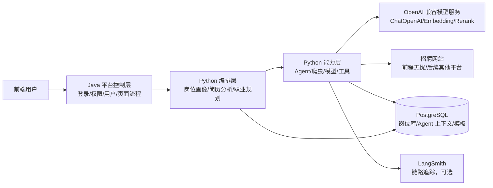
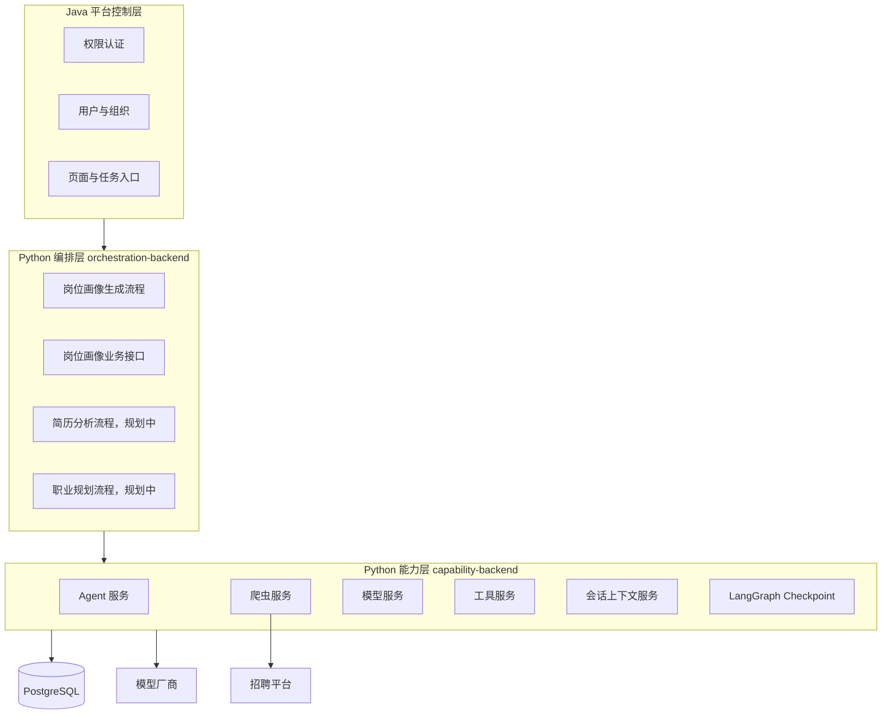
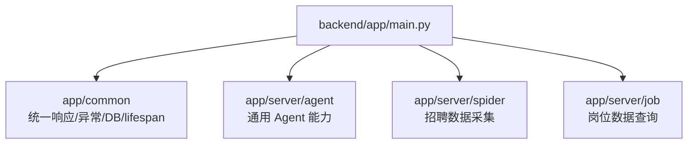
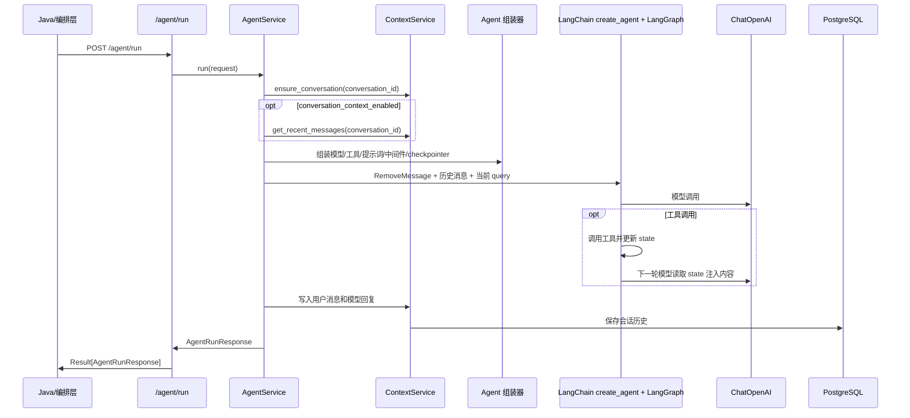
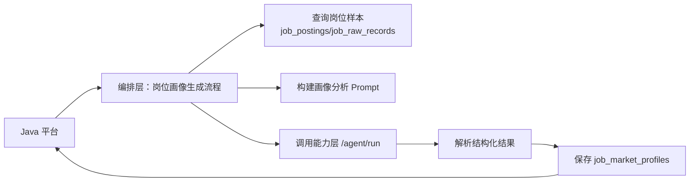

# 就业指导 AI 平台架构图

## 1. 总体边界

当前平台建议拆成两层 Python 后端：

- 能力层：提供通用 AI 能力，不直接绑定具体业务流程，例如 Agent、模型调用、工具注册、爬虫采集、浏览器自动化、向量检索等。
- 编排层：承接就业指导平台业务流程，例如岗位画像生成、岗位画像增删改查、简历分析流程、职业规划流程等。

Java 后端作为平台控制层，负责登录、权限、用户、组织、页面流转、任务入口和调用 Python 服务。



## 2. 目标服务拆分



## 3. 当前代码结构

当前项目尚未物理拆成两个后端，现状是一个 FastAPI 应用挂载三个模块：



## 4. 推荐演进结构

```text
backend/
  capability_app/
    main.py
    common/
    server/
      agent/
      spider/
      model/
      tools/
      knowledge/

  orchestration_app/
    main.py
    common/
    server/
      job_profile/
      resume_analysis/
      career_planning/
```

拆分原则：

- 能力层不写就业平台业务逻辑，只提供可复用能力。
- 编排层可以写业务逻辑，负责把多个能力组合成业务流程。
- Java 层不直接关心模型、工具、爬虫细节，只调用编排层或少量能力层接口。
- 编排层可以调用能力层，也可以读写业务表。

## 5. Agent 运行链路



## 6. 岗位画像生成链路

岗位画像生成属于编排层，不建议直接写在 Agent 能力层。



