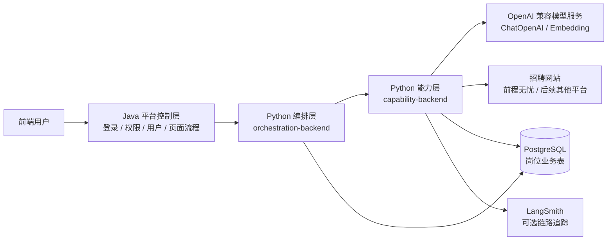
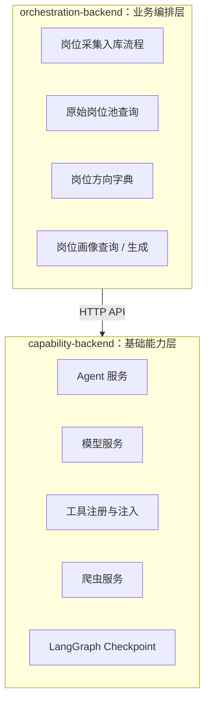
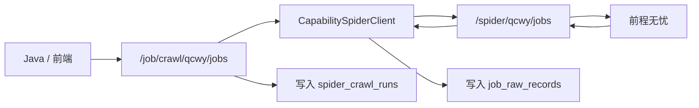
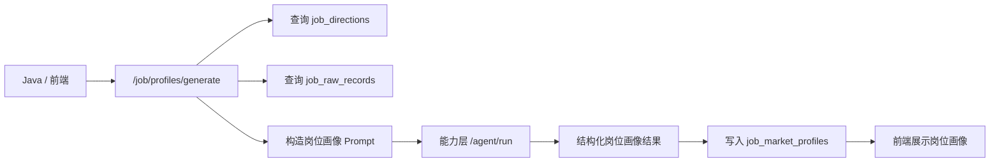
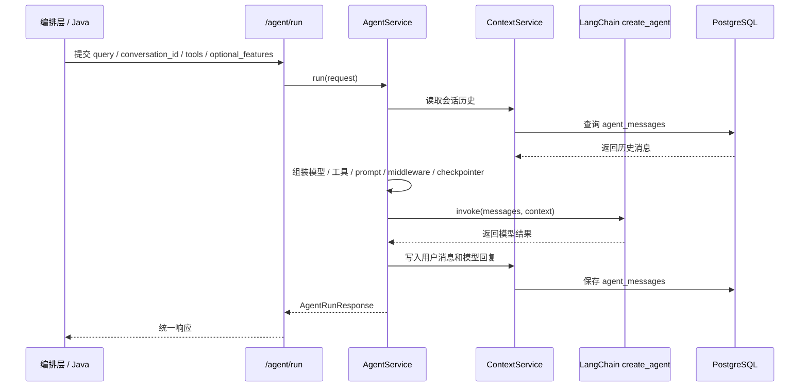
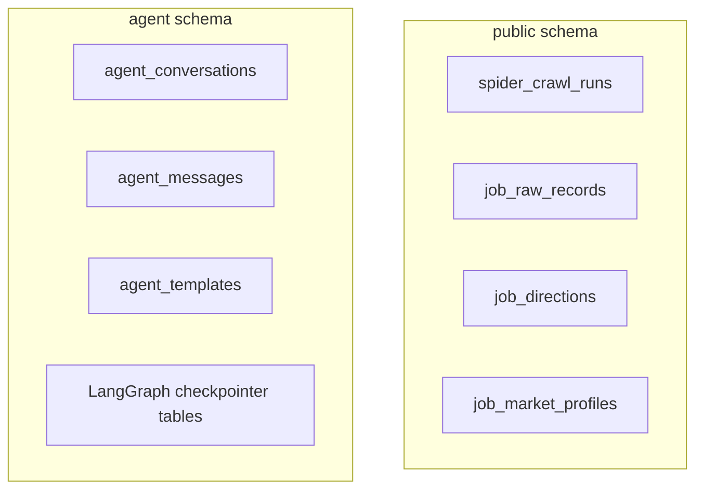

# 架构图

## 1. 总体架构

当前平台拆成 Java 业务入口、Python 编排层、Python 能力层三部分。

## 2. 服务边界

能力层原则：

- 不直接写岗位业务表。
- 不绑定具体就业平台业务流程。
- 提供可复用的 Agent、模型、工具、爬虫能力。

编排层原则：

- 可以读写岗位业务表。
- 负责把多个能力组合成业务流程。
- 与 Java 层通过 API 对接。

## 3. 岗位数据链路

说明：

- `/spider/qcwy/jobs` 属于能力层，只采集并返回 rows。
- `/job/crawl/qcwy/jobs` 属于编排层，负责创建任务、调用能力层、写入数据库。
- 当前只保存原始岗位数据，不再维护标准化岗位主表。

## 4. 岗位画像链路

说明：

- 前端主展示对象是 `job_market_profiles`。
- `job_raw_records` 是岗位画像生成的数据来源。
- `job_directions` 是平台定义的岗位方向字典。

## 5. Agent 运行链路

## 6. 数据库分区

